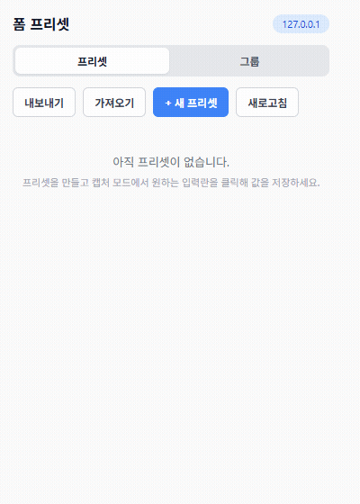
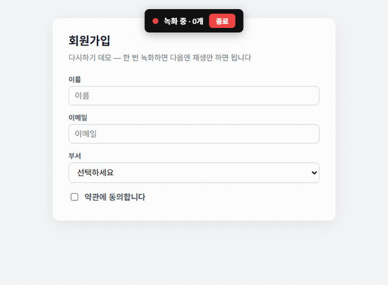
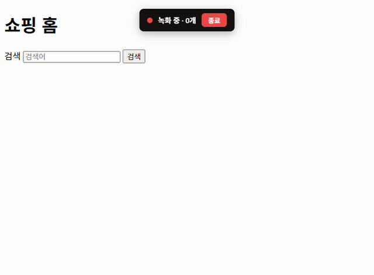

# 다시하기

[저장소](https://github.com/ssw207/dasihagi) · Chrome 확장 · 한국어

사이트에서 한 번 한 **입력·클릭·이동**을 녹화해 두고, **재생**으로 다시 실행합니다.

사내 어드민 제휴 설정, 테스트 계정 넣기, 비슷한 기안처럼 **같은 일을 여러 번** 할 때 씁니다. 화면 글은 모두 한국어입니다.

## 목차

1. [준비물](#준비물)
2. [설치](#설치)
3. [5분 안에 써 보기](#5분-안에-써-보기)
4. [일상적으로 쓰기](#일상적으로-쓰기)
5. [여정과 그룹](#여정과-그룹)
6. [값과 개인정보](#값과-개인정보)
7. [이 제품으로 하지 않는 일](#이-제품으로-하지-않는-일)
8. [문제가 생기면](#문제가-생기면)

### 화면 미리보기

**프리셋 만들기**



**녹화한 뒤 재생**



**여러 페이지 여정 (검색 → 클릭 → 이동)**



---

## 준비물

| 필요한 것 | 하는 일 |
|-----------|---------|
| [Google Chrome](https://www.google.com/chrome/) | 확장을 실행합니다 |
| [Git](https://git-scm.com/) | 저장소를 받습니다 |
| [Node.js](https://nodejs.org/) LTS (18 이상) | `dist` 폴더를 만듭니다 |

PowerShell 또는 터미널에서 확인합니다.

```bash
git --version
node --version
```

숫자가 나오면 됩니다.

---

## 설치

저장소: **https://github.com/ssw207/dasihagi**

### 1. 코드 받기

```bash
git clone https://github.com/ssw207/dasihagi.git
cd dasihagi
```

### 2. 빌드

번들러는 없습니다. 저장소 폴더에서:

```bash
npm run build
```

끝나면 **`dist` 폴더의 전체 경로**가 출력됩니다. 이 줄을 복사해 두세요.

```
빌드 완료 → C:\Users\이름\dasihagi\dist
```

macOS / Linux는 `/Users/이름/dasihagi/dist` 형태입니다.

> 쓰기만 하면 `npm install`은 필요 없습니다. 테스트(`npm run test:e2e` 등)를 돌릴 때만 설치합니다.

### 3. Chrome에 넣기

1. 주소창에 `chrome://extensions` 입력 후 Enter.
2. 오른쪽 위 **개발자 모드**를 켭니다.
3. **압축해제된 확장 프로그램을 로드합니다**를 누릅니다.
4. 폴더 창이 열리면:
   - 주소 칸에 2단계에서 복사한 `dist` 경로를 붙여넣고 Enter, 또는
   - `dasihagi` 폴더 안의 **`dist`** 를 선택합니다. (`popup`이나 프로젝트 루트가 아닙니다.)
5. 목록에 **다시하기**가 보이면 성공입니다.

아이콘이 안 보이면 툴바 퍼즐 조각에서 **다시하기**를 고정(핀)합니다.

### 4. 나중에 업데이트할 때

```bash
cd dasihagi
git pull
npm run build
```

`chrome://extensions`에서 다시하기 카드의 **새로고침**을 누릅니다.

---

## 5분 안에 써 보기

저장소에 연습 페이지가 있습니다. **저장소 폴더**에서:

```bash
npx --yes serve .
```

브라우저에서 `http://localhost:3000/test/test-form.html` 을 엽니다. 포트가 다르면 터미널에 나온 주소를 씁니다.

1. 툴바 **다시하기**를 엽니다.
2. **이 사이트 녹화**를 누릅니다.
3. 연습 페이지에서 이름·이메일을 넣고 부서·약관을 고릅니다.
4. 화면 위 빨간 **종료** 또는 팝업 **종료**를 누릅니다.
5. 칸을 지운 뒤 카드의 **재생**을 누릅니다. 값이 돌아오면 설치가 끝난 것입니다.

파일을 더블클릭해 열면 주소가 `file://`입니다. 그때는 확장 상세에서 **파일 URL에 대한 액세스 허용**을 켜거나, 위처럼 로컬 서버를 쓰세요.

---

## 일상적으로 쓰기

### 이 사이트 녹화

1. 값을 넣을 사이트(사내 어드민 포함)를 엽니다.
2. **다시하기** → **이 사이트 녹화**.
3. 평소처럼 입력·클릭합니다.
4. **종료**하면 저장됩니다.
5. 다음에 **재생**하면 같은 순서로 실행됩니다.

이름을 직접 지으려면 **+ 새 프리셋**으로 만든 뒤 **⋯ → 녹화**를 누릅니다.

### 화면 안내

| 보이는 것 | 하는 일 |
|-----------|---------|
| **이 사이트 녹화** | 지금 사이트로 항목을 만들고 바로 녹화 |
| **현재 사이트만** | 지금 탭과 맞는 것만 목록에 표시 (기본 켜짐) |
| **재생** | 저장한 값과 행동을 실행 |
| **⋯** | 녹화, 편집, 삭제 |
| **재생 속도** 빠름 / 보통 / 느림 | 페이지 이동 뒤 쉬는 시간. 사내는 **빠름** |
| **녹화 중** 배너 | 팝업을 닫았다 열어도 녹화 중이면 보입니다 |

여러 개를 지우려면 왼쪽 칸을 고르고 **선택 삭제**를 누릅니다. 확인 없이 지우지 않습니다.

### 편집

**⋯ → 편집**에서 이름, 사이트 패턴(한 줄에 하나), 칸의 표시 이름을 고칩니다.

**페이지 진입 시 자동 적용**을 켜면 그 사이트에 들어올 때 폼이 채워집니다. 검색·클릭이 들어 있는 **여정**은 자동 적용되지 않습니다.

### 캡처 (칸 이름을 직접 정할 때)

편집에서 **캡처 모드 시작** → 파란 점선 칸을 클릭 → 이름 Enter → 값 Enter. 녹화로 빠진 칸만 보완할 때 씁니다.

### 내보내기 / 가져오기

**더보기**에 있습니다.

- 내보내기: JSON 파일에 **실제 값**이 들어갑니다. 파일을 안전하게 보관하세요.
- 가져오기: 기존 항목은 그대로 두고 새 항목이 붙습니다.

---

## 여정과 그룹

| | 여정 | 그룹 |
|--|------|------|
| 언제 | 검색 → 클릭 → 이동처럼 **한 흐름** | 페이지마다 **폼만** 순서대로 (제휴사 A→B→C) |
| 저장 | 프리셋 하나 | 이미 만든 프리셋을 스텝으로 연결 |
| 재생 | 같은 탭에서 순서대로 | 스텝마다 **새 탭** |
| 제출 | 녹화한 클릭만. 결제는 직접 | 스텝을 **수동** 또는 **자동 제출** |

### 여정

페이지가 바뀌어도 **녹화 중** 칩이 다시 뜹니다. A에서 연 팝업/새 탭에서도 이어지고, 팝업을 닫아도 A 녹화는 유지됩니다. 같은 페이지의 입력 레이어(열기 → 입력 → 확인)도 기록됩니다.

사내 어드민이 **iframe** 안이어도 그 안에서 녹화·재생됩니다. 아주 작은 iframe에는 칩이 안 보일 수 있고, 그때는 바깥 페이지 칩에서 종료하면 됩니다.

광고·로그인·검색 순위가 자주 바뀌면 재생이 실패할 수 있습니다. 그 단계만 다시 녹화하세요.

### 그룹

1. 페이지마다 프리셋을 만듭니다.
2. **그룹** 탭 → **+ 새 그룹** → 순서대로 스텝 추가.
3. **수동**: 값만 채움. 저장은 내가 하고 **다음 단계**.
4. **자동 제출**: 채운 뒤 제출 버튼 클릭 (예: `button[type="submit"]`).
5. **실행**. 아이콘에 `2/3`이 보입니다. **중지**로 끊을 수 있습니다.

---

## 사이트 패턴

편집에서 한 줄에 하나씩 적습니다. 녹화 중 방문한 사이트는 종료 시 자동으로 붙습니다.

| 적는 예 | 의미 |
|---------|------|
| `example.com` | 그 사이트 모든 페이지 |
| `*.example.com` | 하위 도메인 포함 |
| `example.com/admin/*` | admin 경로만 |
| `127.0.0.1:3000` | 로컬 서버 (포트 포함) |

---

## 값과 개인정보

- 값은 이 Chrome 프로필 안에서 암호화되어 저장됩니다.
- 휴대폰·이메일·비밀번호처럼 보이는 칸은 목록에서 `••••••`로 가립니다.
- 다른 PC로 옮기려면 **내보내기 → 가져오기**를 씁니다.
- “암호화 키가 없/손상”이면 이 프로필의 예전 항목을 풀 수 없습니다. 백업 JSON이 있으면 가져오기로 복구하세요.

---

## 이 제품으로 하지 않는 일

- 좌석 오픈런, 대기열, 캡차, 보안 키패드
- 파일·이미지 첨부
- `chrome://` 같은 크롬 내부 페이지
- sandbox로 막힌 iframe, 데스크톱 전용 프로그램

재생은 칸을 채우고 클릭을 재현합니다. 결제·상신·전송은 직접 누르는 편이 안전합니다.

---

## 문제가 생기면

| 증상 | 해결 |
|------|------|
| 아이콘이 없음 | 개발자 모드 확인. 툴바에서 고정 |
| `npm run build`를 찾을 수 없음 | `package.json`이 있는 폴더인지 확인 |
| 값이 안 채워짐 | 확장 **새로고침** + 페이지 새로고침. 사이트가 바뀌었으면 다시 녹화 |
| iframe에서 안 됨 | 확장 새로고침 후 **iframe 안**에서 녹화. 칩이 없으면 바깥에서 종료 |
| 팝업 창에서 녹화가 끊김 | 최신으로 빌드했는지 확인. A에서 연 창이어야 이어집니다 |
| 재생이 너무 느리거나 빠름 | **재생 속도**. 사내는 빠름 |
| chrome:// 에서 녹화가 비활성 | 정상입니다 |
| 사이트 개편 후 실패 | 다시 녹화하거나 캡처 |

---

## 개발자만

작업 메타프롬프트는 [`메타프롬프트/`](메타프롬프트/)에 있습니다.

사용에는 아래 명령이 필요 없습니다.

```bash
npm install
npm run check
npm run test:encrypt
npm run test:pii
npm run test:replay
npm run test:e2e
```

README 움짤을 다시 찍으려면 `npm run gif` 입니다.
